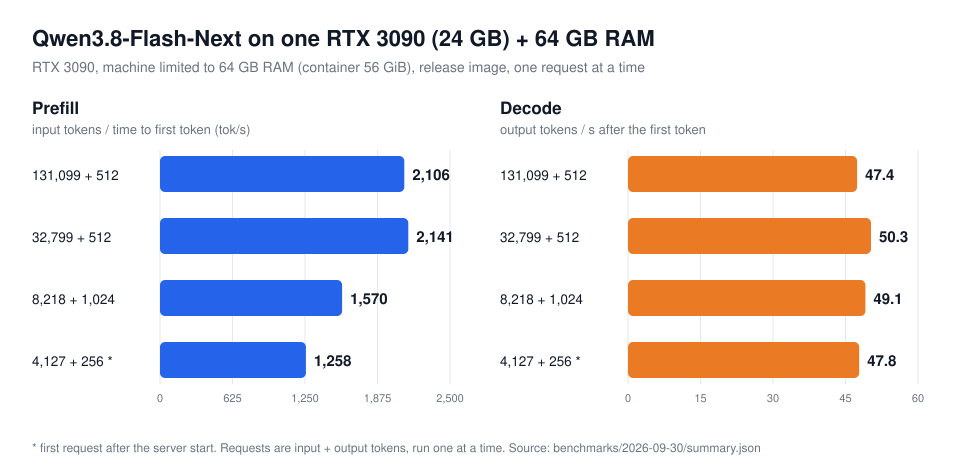

# Qwen3.8-Flash-Next on a single RTX 3090 (24 GB) + 64 GB RAM

<h2 align="center">2,100 tok/s prefill · 47 tok/s decode · 128K context</h2>
<p align="center"><strong>One RTX 3090 24 GB · 64 GB system RAM · vLLM · OpenAI-compatible API · Docker</strong></p>
<p align="center">One request, best of 2: a 131,099-token prompt reaches the first token in 62 s (2,106 tok/s), then decodes at 47.4 tok/s.</p>
<p align="center">
  <a href="https://huggingface.co/albucino/Qwen3.8-Flash-Next-W4A16-FP8PLE"><strong>Download the checkpoint</strong></a> ·
  <a href="#quick-start">Quick start</a> ·
  <a href="docs/how-it-works.md">How it works</a> ·
  <a href="docs/faq.md">FAQ</a> ·
  <a href="https://github.com/DominikBucko/qwen38-flash-next-2x3090">Two GPUs?</a>
</p>

Run **Qwen3.8-Flash-Next locally on one RTX 3090 and 64 GB of RAM**: one of the most common local-AI machines.
The checkpoint (INT4 experts, FP8 embedding table) is 125 GB, about five times the card's memory. This runtime
keeps the attention and dense weights plus the 32 busiest experts of every layer on the GPU, and **the CPU
computes the other experts straight from RAM** during decode. During prefill it streams all experts through the
GPU, so long prompts stay fast. The full 128K context fits thanks to an INT8 KV cache.

It is the same checkpoint and the same vLLM build as the
[2× RTX 3090 runtime](https://github.com/DominikBucko/qwen38-flash-next-2x3090), repackaged for half the
hardware. Nothing is pruned or requantized.

## Results

One RTX 3090, the machine limited to **64 GB of RAM** (the server container to 56 GiB), release image, default
profile, one request at a time, greedy decoding with MTP speculative decoding. Two runs on fresh server starts,
one with the image built locally and one with the published image pulled by digest:

| Request (input + output tokens) | First token | Prefill | Decode |
|---|---:|---:|---:|
| 131,099 + 512 | 62.2 / 90.3 s | **2,106** / 1,451 tok/s | **47.4** / 43.3 tok/s |
| 32,799 + 512 | 15.3 / 14.8 s | 2,141 / 2,219 tok/s | 50.3 / 49.5 tok/s |
| 8,218 + 1,024 | 5.2 / 5.7 s | 1,570 / 1,452 tok/s | 49.1 / 48.5 tok/s |
| 4,127 + 256, first request after start | 3.3 / 3.4 s | 1,258 / 1,231 tok/s | 47.8 / 50.8 tok/s |



GPU memory peaked at 23.4 GB and no request was preempted. Prefill runs at 2,100–2,200 tok/s when the expert
reads from NVMe overlap the GPU work; some requests take a slower path, ~1,450 tok/s (the second 131K run and
both 8K requests above). See the [known issue](benchmarks/2026-09-30/README.md#known-issue-occasional-slow-prefill-steps).

**Decode depends mainly on RAM bandwidth**, because the CPU computes the cold experts. With the server restricted
to part of the 32-core benchmark CPU:

| CPU cores available | Like | Prefill, 131K prompt | Decode |
|---|---|---:|---:|
| 32 (4 CCDs), 2 runs | the benchmark workstation | 1,451–2,106 tok/s | 43–51 tok/s |
| 16 (2 CCDs), 2 runs | Ryzen 9 7950X / 9950X | 1,452–2,104 tok/s | 39–47 tok/s |
| 8 (1 CCD), earlier image | Ryzen 7 7800X3D / 9700X | 2,149 tok/s | 34–36 tok/s |

These are proxies on the same Zen 3 cores and DDR4 memory. Desktop Zen 4/5 and Intel CPUs with DDR5 have more
memory bandwidth per core and may do better. See the [benchmark report](benchmarks/2026-09-30/README.md) and
[hardware](docs/hardware.md), and please [share your numbers](https://github.com/DominikBucko/qwen38-flash-next-3090/issues/new?template=hardware-report.yml).

With a second RTX 3090, the [2× RTX 3090 runtime](https://github.com/DominikBucko/qwen38-flash-next-2x3090)
reaches 3,410 tok/s prefill and 84 tok/s decode with the same 64 GB of RAM (its
[64 GB profile](https://github.com/DominikBucko/qwen38-flash-next-2x3090#new-64-gb-ram-profile), which uses this
runtime's design on both cards), or 3,029 and 109.8 tok/s with 128 GB.

## What you need

- **GPU:** one NVIDIA card with 24 GB (RTX 3090 tested; 3090 Ti, 4090 and other 24 GB cards should work).
- **RAM:** 64 GB. With 96 GB or more every expert stays in RAM.
- **CPU:** x86-64 with AVX2 (any Ryzen, Intel Core since 2013).
- **Disk:** an NVMe SSD with ~130 GB free: the checkpoint is also read while serving.
- **Software:** Linux, Docker, the NVIDIA Container Toolkit, NVIDIA driver 580 or newer.

## Quick start

Download the checkpoint (about 129 GB) to an NVMe drive. `hf` comes with `pip install -U huggingface_hub`.

```bash
hf download albucino/Qwen3.8-Flash-Next-W4A16-FP8PLE \
  --revision ef554143369a706525336f6b42a09094835dc077 \
  --local-dir /models/qwen38-flash-next
```

Build and start the server:

```bash
git clone https://github.com/DominikBucko/qwen38-flash-next-3090.git
cd qwen38-flash-next-3090
cp .env.example .env    # set MODEL_DIR to the download directory

make build-image
make serve
```

`make serve` runs `scripts/preflight.sh` first, which checks the GPU, RAM, CPU, driver and disk. The server is
ready after about 4 minutes (the first start compiles kernels and takes longer) and listens on
`http://127.0.0.1:8000/v1`.

To skip the local build, use the published v0.1.0 image (weights stay a separate download):

```bash
IMAGE=ghcr.io/dominikbucko/qwen38-flash-next-3090@sha256:7f176605b59c462af21b1b62fd854f9f3cca96e3d11a295581297483d45490a3 make serve
```

Later releases list their digests in the [release notes](https://github.com/DominikBucko/qwen38-flash-next-3090/releases).

Check it and measure your machine:

```bash
python3 scripts/smoke_test.py   # a reasoning answer, a tool call, code
make bench                      # 4K, 32K, 131K and 8K prompts
```

```bash
curl http://127.0.0.1:8000/v1/chat/completions -H 'Content-Type: application/json' -d '{
  "model": "Qwen3.8-Flash-Next",
  "messages": [{"role": "user", "content": "Explain mixture-of-experts models in three sentences."}]
}'
```

Any OpenAI-compatible client works with the base URL `http://127.0.0.1:8000/v1`. Tool calls, reasoning output
(`reasoning_content`) and prefix caching are on.

## How it fits

| Where | What |
|---|---|
| GPU, 23.4 GB peak | Attention, recurrent and dense weights (9.8 GB), 32 hot experts per layer (3.9 GB), MTP draft, INT8 KV cache for 141,504 tokens (3.05 GB) |
| RAM, 56 GiB container | 19,480 of the 23,040 cold experts (46 GiB, huge pages), serving processes, page cache |
| NVMe | The FP8 per-layer embedding table (51 GB) and the 3,560 least-used experts, read in place from the checkpoint |

- **Decode:** per layer, the GPU runs the hot experts, a pinned CPU thread pool computes the cold ones (AVX2,
  FP32 accumulation), and the GPU computes about 22% of the cold experts itself over PCIe while it waits. MTP
  drafts 3 tokens per step. NVMe experts that decode uses move into RAM as it runs.
- **Prefill:** 8,192-token chunks; each layer's cold experts are copied to the GPU in groups of 80 (~27 GB/s),
  converted to the GPU kernel layout and computed there, overlapping the next copies.

The runtime picks the CPU cores and the RAM arena size from your machine. Details:
[how it works](docs/how-it-works.md) · [tuning and troubleshooting](docs/tuning.md).

## If it runs out of memory

- **GPU:** the profile peaks at 23.4 GB of 24 GB. If the card also drives your desktop, lower
  `QWEN38_HOT_ONLY` from 32 to 28 in `.env` (~465 MiB less), or shorten the context. See
  [GPU memory](docs/tuning.md#gpu-memory).
- **RAM:** the container gets the installed RAM minus 8 GiB (`MEMORY_LIMIT=auto`) and sizes its expert arena to
  fit. Set `MEMORY_LIMIT=48g` or `HOST_RESERVE_GIB=12` to leave more for other programs; more experts then stay
  on NVMe.

## Limitations

- One request at a time (others queue), up to 135,168 tokens each.
- Tested on one machine: an RTX 3090 with a 32-core Threadripper PRO limited to 64 GB of RAM. Desktop CPUs and
  other 24 GB GPUs are not tested yet; please [share your results](https://github.com/DominikBucko/qwen38-flash-next-3090/issues/new?template=hardware-report.yml).
- The first start compiles GPU kernels; the first ~64 decode steps after a new long prompt are slower while the
  RAM arena adapts.
- Some prefill requests take a slower path (~5.5 s instead of ~3.7 s per 8,192-token chunk); the cause is still
  open. See the [benchmark report](benchmarks/2026-09-30/README.md#known-issue-occasional-slow-prefill-steps).
- The INT8 KV cache is checked with greedy-decoding agreement only (within run-to-run noise of BF16); no
  likelihood or benchmark-suite comparison yet.
- Linux only.

## Related

- [qwen38-flash-next-2x3090](https://github.com/DominikBucko/qwen38-flash-next-2x3090): the same model on two
  RTX 3090s, either with 64 GB of RAM ([64 GB profile](https://github.com/DominikBucko/qwen38-flash-next-2x3090#new-64-gb-ram-profile):
  3,410 tok/s prefill, 84 tok/s decode, 128K context) or with 128 GB (3,029 tok/s prefill, 110 tok/s decode, up
  to 256K context).
- [albucino/Qwen3.8-Flash-Next-W4A16-FP8PLE](https://huggingface.co/albucino/Qwen3.8-Flash-Next-W4A16-FP8PLE):
  the checkpoint (Intel AutoRound W4A16 target, FP8 PLE table, INT4 MTP draft).

## License

The runtime code is Apache-2.0. The model keeps the upstream Qwen and third-party terms listed in
[`THIRD_PARTY_NOTICES.md`](THIRD_PARTY_NOTICES.md).
